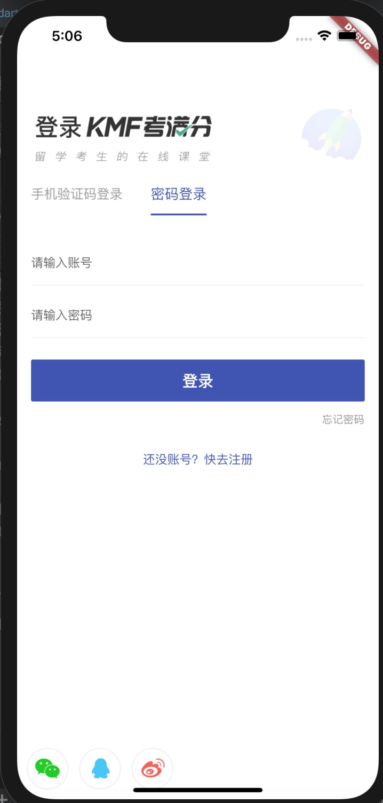

# course_flutter

本项目为学习Flutter的练习项目（主要为UI练习）

## 部分页面效果如下:
| ![Image text]](./picture/1.jpg)    |

## 实现内容
* mvp模式
* 使用provider 做状态管理
* 下拉刷新 + 上拉加载更多
* 模块化路由管理
* 使用Sliver 系列组件实现复杂滚动效果
## 注意事项
* 保利威视视频播放目前仅支持Android
## Getting Started

This project is a starting point for a Flutter application.

A few resources to get you started if this is your first Flutter project:

- [Lab: Write your first Flutter app](https://flutter.dev/docs/get-started/codelab)
- [Cookbook: Useful Flutter samples](https://flutter.dev/docs/cookbook)

For help getting started with Flutter, view our
[online documentation](https://flutter.dev/docs), which offers tutorials,
samples, guidance on mobile development, and a full API reference.
